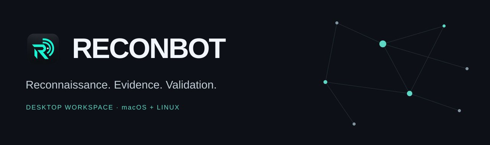
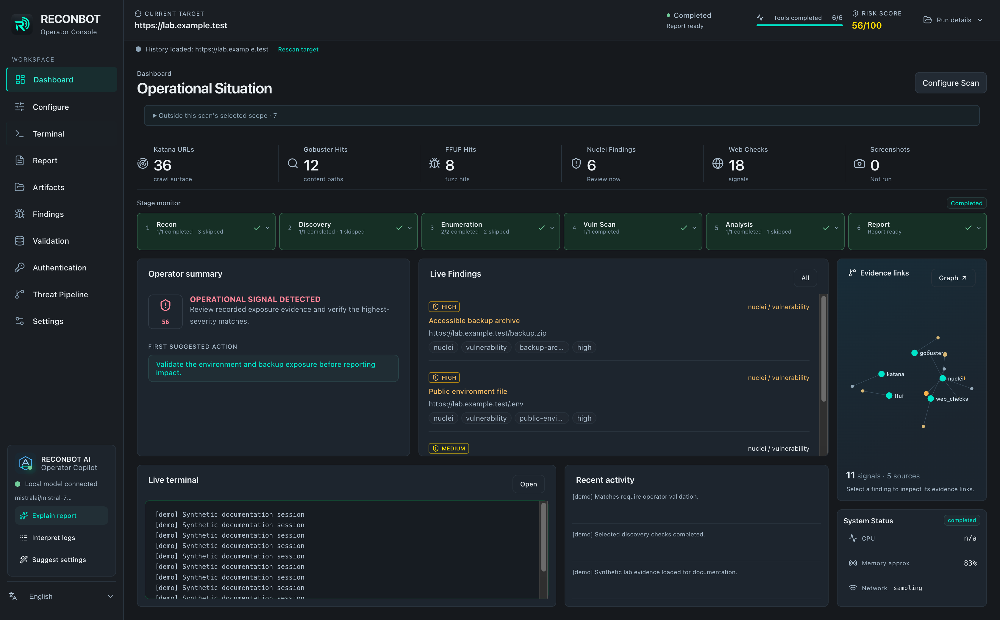
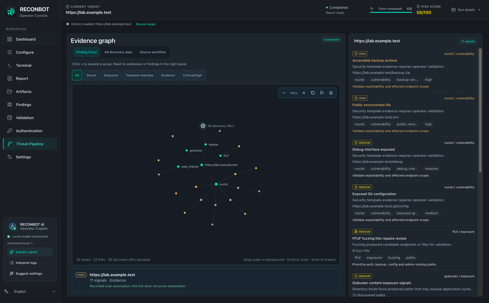

# ReconBot

A desktop workspace for reconnaissance, evidence review and focused security validation. Built with Python, Electron, React and TypeScript.

**Beta release · macOS Apple Silicon + Linux x86_64 / ARM64 · English / Türkçe UI**

[Download beta](https://github.com/mpol4t/Reconbot/releases/tag/v0.1.0-beta.1) · [Getting started](docs/getting-started.md) · [Türkçe rehber](docs/first-use-tr.md) · [Test locally](docs/testing.md)



*Actual packaged application with synthetic documentation data. The example target, findings and score are illustrative; they are not results from a public target.*

## One workspace, from discovery to review

| Workspace | What you can do |
| --- | --- |
| **Configure & Dashboard** | Select tools, tune scan limits and follow recorded stage status. |
| **Terminal & Report** | Read live output and review an HTML report while the scan continues. |
| **Findings & Evidence graph** | Filter matches, inspect exact addresses and expand grouped discovery data. |
| **Validation** | Run an independent SQLmap check for one GET or fixed POST parameter. |
| **Authentication** | Test HTTP Basic or fixed POST forms with selected credential lists. |
| **History & Wordlists** | Reopen previous runs and save/lock list paths across app restarts. |
| **Local AI — experimental** | Ask a locally hosted model about the selected evidence, logs and next steps. |

ReconBot orchestrates established tools including Nmap, Subfinder, DNSX, HTTPX, Katana, Gobuster, FFUF, Nuclei, WAFW00F and WhatWeb. Install the tools you select separately; scanner executables, wordlists, browser runtime and AI models are not bundled with the application.

## Install

Download an asset from the [beta release](https://github.com/mpol4t/Reconbot/releases/tag/v0.1.0-beta.1):

| Platform | Package |
| --- | --- |
| macOS Apple Silicon | `ReconBot-0.1.0-mac-arm64.dmg` or `.zip` |
| Linux x86_64 | `ReconBot-0.1.0-linux-amd64.deb` or `ReconBot-0.1.0-linux-x86_64.AppImage` |
| Linux ARM64 | `ReconBot-0.1.0-linux-arm64.deb` or `ReconBot-0.1.0-linux-arm64.AppImage` |

The installers contain the desktop interface and Python backend. **End users do not need npm or a separate Python installation.**

- **macOS:** open the DMG and drag ReconBot into Applications. Quit an older running version before replacing it; keep the application workspace to preserve history and settings.
- **Linux:** install the DEB with your package manager or make the AppImage executable and launch it.

macOS packages are unsigned and not notarized. Linux packages passed Debian 12 package tests on x86_64 and ARM64 under Xvfb. An Ubuntu ARM64 VM installation was also confirmed by the operator with responsive navigation. A Kali ARM64 VM has unresolved 30–45-second UI delays; other desktop/distribution combinations remain unverified. Intel macOS and Windows packages are not provided in this beta. See [installation and prerequisites](docs/getting-started.md).

## Start a scan

1. Open **Configure**, enter a target you own or are authorized to test, and select the relevant tools.
2. Choose a discovery wordlist where required. **Save and lock** remembers its path; unlock it when you want to change lists.
3. Start the scan and follow **Dashboard** or **Terminal**.
4. Review **Report**, **Findings** and **Threat Pipeline**. Disabled tools, failed checks and incomplete scans are shown separately.
5. Use **Validation** or **Authentication** for an explicit, independent test tied to the selected scan target.

A template match requires review; it does not automatically establish exploitation. No matches do not prove a target has no vulnerabilities. SQL and authentication jobs preserve the original scan score.

## Explore the evidence



The graph starts with findings and grouped discovery URLs. Expand a group to read its addresses in the inspector, copy an exact URL or show it on the graph. Drag nodes, pan, zoom, adjust sensitivity and clear selection with Escape or Reset. Links show recorded associations, not a proven attack chain.

SQLmap evidence reports label the actual test payload. Authentication results show accepted or candidate credentials first, with remaining attempts in a collapsed, paginated list. Automatic form comparison needs no success text, but a repeatable response difference is **a candidate requiring manual verification**, not confirmed login. Dynamic CSRF, JavaScript login, MFA and SSO are outside the current form-testing scope.

## Optional local AI

Start an OpenAI-compatible local model server, select its loaded chat model in **Settings → Operator Copilot**, then choose **Test connection**. The default endpoint is `http://127.0.0.1:1234/v1`.

**The AI feature is experimental.** Real conversation tests found incorrect CVE attribution and verification advice from the tested local models. Connection success is not a technical-accuracy check. The copilot does not perform live CVE lookup, execute terminal commands or change scan findings/scores. Suggested settings require explicit approval. Scanning and reporting work without AI.

Messages, supplied context values and final provider answers are preserved without secret masking. Review model explanations against the original evidence. See [AI behavior and limitations](docs/ai-operator-copilot.md).

## Verification

Before this beta was prepared:

- **533 Python tests and 69 subtests passed.**
- **45 desktop unit tests passed;** TypeScript and production builds passed.
- Native macOS and Linux package checks covered application identity, the bundled backend, navigation, offline reports, graph interactions, SQL validation and authentication workflows.
- Four local synthetic sites exercised discovery, selected Nuclei templates, SQL positive/negative cases and authentication controls.

These are recorded local checks, not a guarantee of universal correctness. Live-model semantic acceptance remains failed. Ubuntu ARM64 VM navigation was confirmed responsive by the operator; the Kali ARM64 VM UI delay remains unresolved. See [test evidence and reproducible commands](docs/testing.md).

## Beta acceptance

For architecture selection and manual installation checks, see [the Kali test guide](docs/kali-private-test.md), originally prepared for the private acceptance phase. Release assets are now public. Linux packages support x86_64 and ARM64; choose the package matching your architecture. The Kali VM UI delay noted above is an open beta issue.

## Develop

Use Python **3.11+**, Node.js **22.12+**, and the required native build tools.

```bash
git clone https://github.com/mpol4t/Reconbot.git
cd Reconbot
python3 -m venv .venv
.venv/bin/python -m pip install -r requirements.txt
cd desktop
npm ci
npm run rebuild:pty
npm run dev
```

For checks, contribution guidelines and native packaging, see [CONTRIBUTING.md](CONTRIBUTING.md) and [desktop build instructions](desktop/README.md). [Architecture](docs/architecture.md) explains how the UI, processes and artifacts connect.

## License and use

ReconBot's original code is licensed under [GNU GPL version 3 only](LICENSE) (`GPL-3.0-only`). Copyright © 2026 Polat ([mpol4t](https://github.com/mpol4t)); see [COPYRIGHT](COPYRIGHT). Distributed derivative versions must comply with GPL source-sharing and notice requirements; commercial use is permitted. Third-party components retain their own licenses; see [THIRD_PARTY_NOTICES.md](THIRD_PARTY_NOTICES.md). Use only against systems you own or have explicit authorization to test. Keep real reports, credentials and private runtime data out of public repositories.

[Native dependency inventories](docs/licenses/README.md) record the versions used in each platform package.

Created by [mpol4t](https://github.com/mpol4t).
