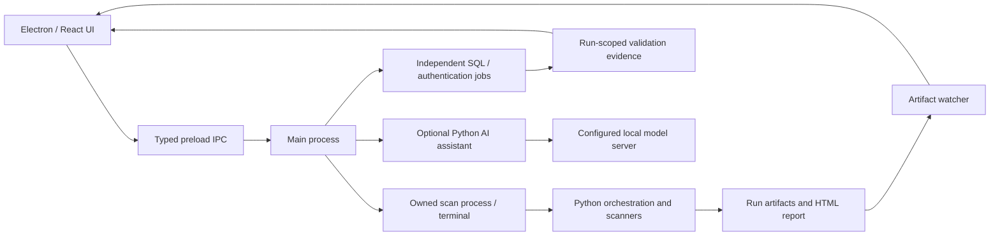

# Architecture

## Responsibilities

- `desktop/src/main`: process ownership, selected-run scope, persistence, report protocol, dependency checks and bounded IPC.
- `desktop/src/renderer`: configuration, navigation, evidence inspection and pane-owned scrolling; no direct Node/filesystem/process access.
- `reconbot/orchestration` and `reconbot/runtime`: configuration, output identity, scan lifecycle and process cleanup.
- `reconbot/core`: scanner wrappers and structured results; external executables remain separate.
- `reconbot/report`: evidence interpretation, coverage and offline HTML rendering.
- `reconbot/validation`: independent SQLmap and authentication jobs; their results do not rewrite the originating scan score.
- `reconbot/ai`: artifact context, prompt assembly, request budgets, compatible local-provider calls and concrete integrity checks.

Each run has its own artifact directory. Historical selection does not grant ownership of an unrelated active process. Failed/partial checks are distinct from tools disabled by the operator. A completed tool's zero matches apply only to its actual scope.

The graph links recorded sources, addresses and findings. A link is an association, not evidence of exploitation. The copilot is an optional explanation layer; its factual accuracy depends on the selected model and is not established by a successful request.
